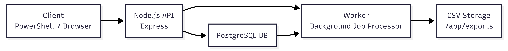

# CSV Export Service

Production‑ready backend system that generates **large CSV exports (1M+ rows)** asynchronously using **Node.js, PostgreSQL, Docker, and background workers**.

---

# Features

* Dockerized **Node.js + PostgreSQL** stack  
* Automatic **database seeding with 1,000,000 users**  
* **Async background worker** for CSV generation  
* **Memory‑safe streaming** for huge datasets  
* **Job queue with concurrency control**  
* **Atomic job locking** using `FOR UPDATE SKIP LOCKED`  
* **Progress tracking** in database  
* **Cancelable export jobs**  
* **Download generated CSV files**  
* **Health check endpoint**  
* Production‑ready **error handling & cleanup**

---

# Architecture Overview

```
Client → REST API → PostgreSQL (jobs table)
                    ↓
               Background Worker
                    ↓
              CSV File Generation
                    ↓
                 File Download
```
## Architecture



### Key Concepts

**Async Processing**  
Exports run in background so API stays fast.

**Streaming CSV**  
Rows are written in batches → avoids memory crash with millions of records.

**Atomic Job Claiming**  
Prevents multiple workers from processing same job.

**Cancelable Jobs**  
Worker checks DB status during processing and stops safely.

---

# Tech Stack

* **Node.js 20**  
* **Express.js**  
* **PostgreSQL 15**  
* **pg (node‑postgres)**  
* **csv-stringify**  
* **Docker & Docker Compose**

---

# Project Structure

```
src/
 ├── api/            # REST endpoints
 ├── db/             # PostgreSQL connection
 ├── worker/         # Background export worker
 ├── server.js       # Express app entry

seeds/
 ├── 01-schema.sql
 ├── 02-seed.sql
 └── 03-million-users.sql

exports/             # Generated CSV files (Docker volume)
Dockerfile
docker-compose.yml
README.md
```

---

# Setup & Run

## 1. Clone Repository

```bash
git clone <your-repo-url>
cd csv-export-service
```

## 2. Start with Docker

```bash
docker compose up --build
```

This will:

* Start PostgreSQL  
* Create schema  
* Insert **1,000,000 users**  
* Start API + background worker  

---

# API Endpoints

## Health Check

```http
GET /health
```

Response:

```json
{ "status": "ok" }
```

---

## Create Export Job

```http
POST /exports
```

Response:

```json
{
  "jobId": "uuid",
  "status": "pending"
}
```

---

## Cancel Export

```http
POST /exports/:id/cancel
```

Cancels job **during processing**.

---

## Download CSV

```http
GET /exports/:id/download
```

Returns generated CSV file.

---

# How Background Worker Works

1. Polls database every few seconds  
2. Atomically locks **one pending job**  
3. Marks job as **processing**  
4. Streams users table → CSV in batches  
5. Updates **progress %** in DB  
6. Supports **live cancellation**  
7. Marks job **completed** with file path  

---

# Database Tables

## users  
Stores large dataset for export testing.

## exports  
Tracks:  
* job status (`pending | processing | completed | failed | cancelled`)  
* progress percentage  
* file path  
* error message  

---

# Docker Details

### Services

**db** → PostgreSQL with seed scripts  
**app** → Node.js API + worker  

### Persistent Volumes

* Database data  
* Generated CSV files  

---

# Requirements Covered

✔ Async export API  
✔ Large dataset handling (1M rows)  
✔ Background worker queue  
✔ Concurrency control  
✔ Progress tracking  
✔ Cancel support  
✔ CSV download  
✔ Dockerized setup  
✔ Health endpoint  
✔ Production‑safe streaming  
✔ Error handling  
✔ Clean architecture  

---

# Future Improvements

* Redis + BullMQ queue  
* Multiple worker containers (horizontal scaling)  
* S3 storage for CSV files  
* Authentication & rate limiting  
* Export filters & pagination  
